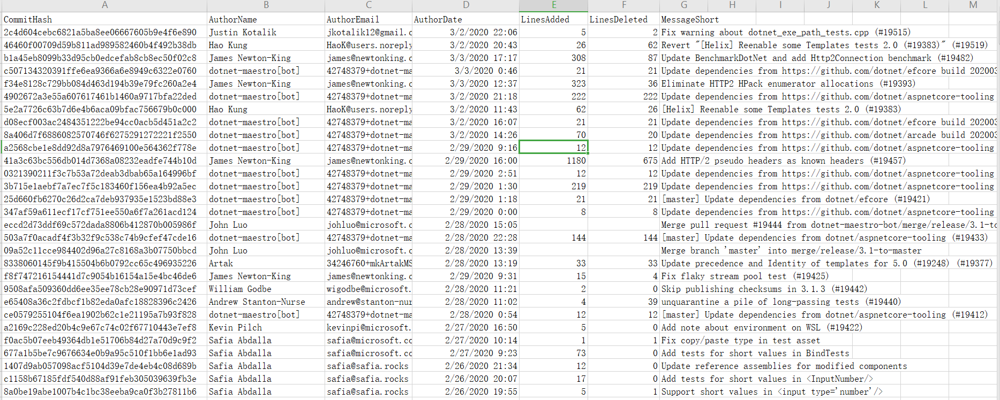

# DotNet GitStats


DotNet GitStats is a command line tool made with DotNet Core, it was used for commit log statistic from a git repo.

Thanks to [libgit2sharp](https://github.com/libgit2/libgit2sharp),
It could fetch every git commit logs from a standard git repo, and extract commit data from these logs.

Also, it could calculate line changes between two commits, for example, lines added and lines deleted number.

Finally, it will generage a csv or json file based on output parameter.

## Supported Platform

- Windows
- Linux

## Usage

```bash
# windows
./DotNetGitStats.exe -d <local repo dir> -o <output file path>

# linux
./DotNetGitStats -d <repo dir> -o <output path>
```

## Example

```bash
# get a csv result file
./DotNetGitStats.exe -d repos\BoatHouse -o result.csv

# get a json result file
./DotNetGitStats.exe -d repos\BoatHouse -o result.json
```

## Data Columns Provided in Output File

- `CommitHash` current git comit id
- `AuthorName`  current commit's author name
- `AuthorEmail` current commit's author email
- `MessageShort` current commit's msg in short line format
- `AuthorDate` commit.Author.When.DateTime
- `LinesAdded` numbers of line added compared with parent commit
- `LinesDeleted` numbers of line added  compared with parent commit

## Generated File Sample



## TODOs

- [x] Set up Github action for CI
- [x] Add README content
- [x] Create POWER BI report using csv file
